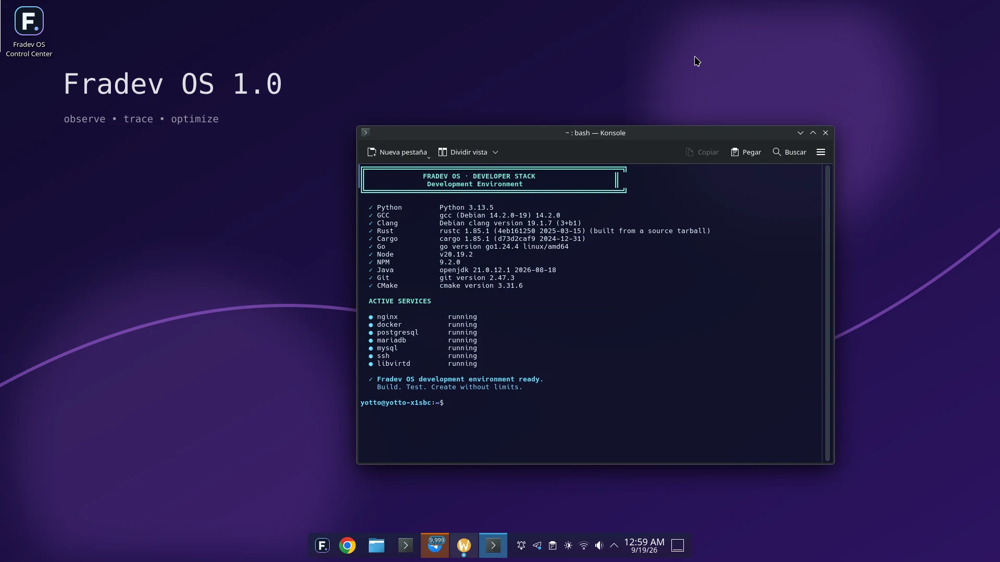
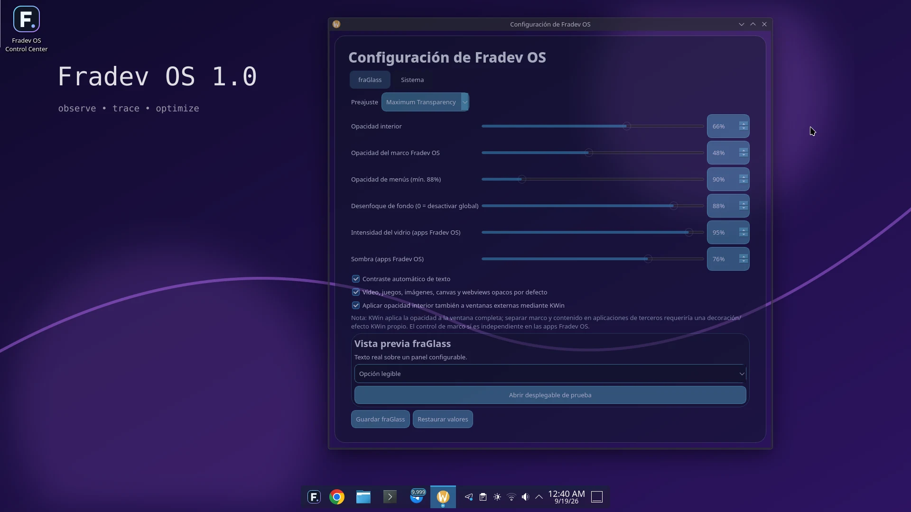
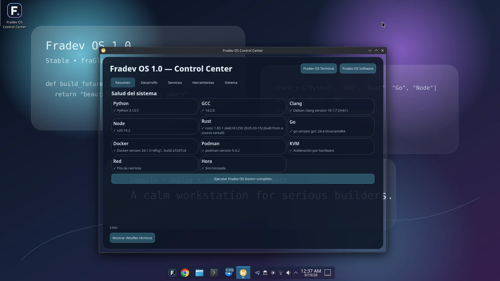
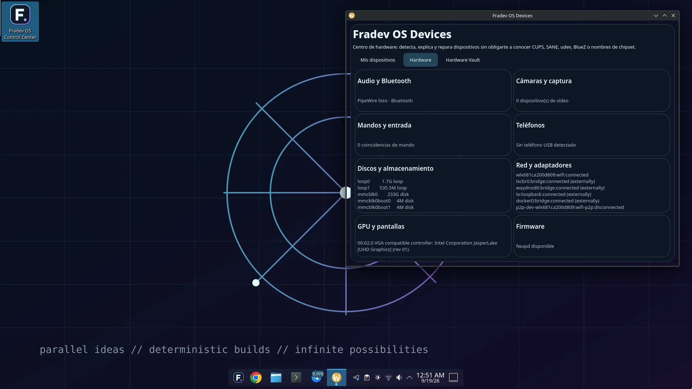
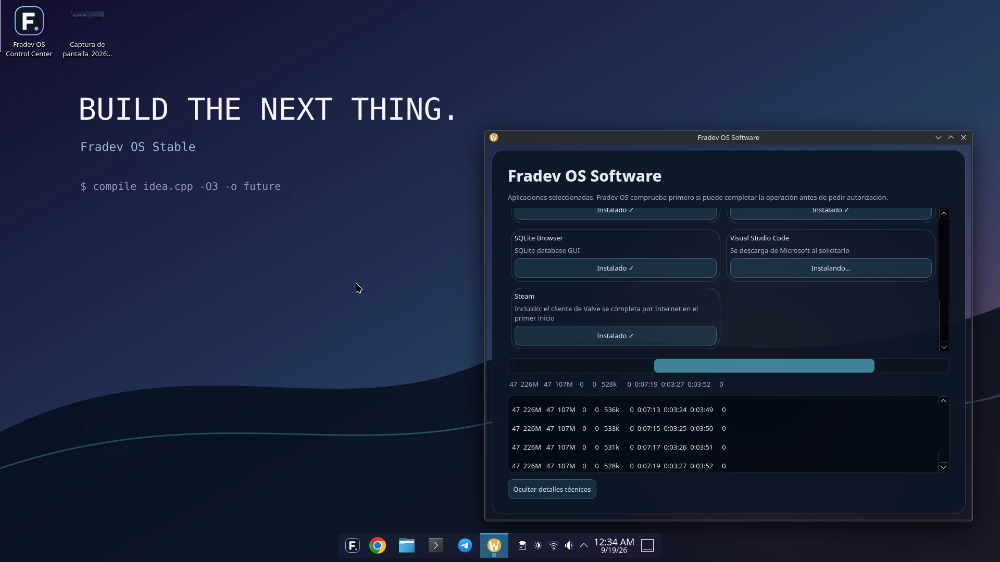

# Fradev OS 1.0 Stable 2

> **Un sistema para crear sin límites.**

**Creador y autor del proyecto:** Fraudy Martínez Madruga  
**Sitio oficial:** https://yottomtnz.github.io/fradevosupdate/  
**Descarga oficial:** https://drive.google.com/uc?export=download&id=1YKA4LaLF0XLBWRFEpcAxmWVcz4KwOHq0  
**Canal estable actual:** Fradev OS 1.0 Stable 2 · actualización pública más reciente **R15**

Fradev OS es un sistema operativo Linux de escritorio basado en Debian 13, pensado para desarrollo, productividad, compatibilidad, juegos y asistencia local con Fradev AI.

## Qué ofrece

- **Entorno de desarrollo listo para trabajar** con herramientas para Python, C/C++, Rust, Go, Java, Web, contenedores, bases de datos y virtualización.
- **fraGlass**, la identidad visual de Fradev OS, con una experiencia moderna, translúcida y configurable.
- **Compatibilidad ampliada** para ejecutar una variedad de aplicaciones y flujos de trabajo.
- **Steam + Game Lab** para juegos y experimentación.
- **Devices** para impresoras, escáneres y otros dispositivos del día a día.
- **Control Center** como punto central del sistema.
- **Fradev AI**, asistente local opcional para programación, depuración y consultas técnicas. Los modelos se descargan aparte según el hardware del usuario.

## Stable 2

Fradev OS 1.0 Stable 2 es la base pública actual. El sistema puede recibir revisiones firmadas mediante su canal estable de actualizaciones.

La revisión pública más reciente declarada por el canal estable es **R15**.

## Descarga

**[Descargar Fradev OS 1.0 Stable 2](https://drive.google.com/uc?export=download&id=1YKA4LaLF0XLBWRFEpcAxmWVcz4KwOHq0)**

## Capturas reales

Estas capturas fueron tomadas directamente de **Fradev OS 1.0 Stable 2 funcionando en hardware real**.

### Developer Stack

### fraGlass

### Control Center

### Devices

### Fradev OS Software

## Proyecto oficial

Este repositorio contiene la presencia pública oficial de Fradev OS: sitio web, recursos públicos y canal de actualizaciones. No es documentación interna del proceso de desarrollo.

## Autoría, atribución y derechos

**Fradev OS fue creado por Fraudy Martínez Madruga.**

Copyright © 2026 Fraudy Martínez Madruga. Todos los derechos reservados sobre los materiales originales de Fradev OS, salvo donde se indique expresamente lo contrario.

El nombre, identidad visual, documentación propia, sitio web, interfaces, arte original y demás materiales originales de Fradev OS no pueden presentarse como creación de terceros ni reatribuirse sin autorización.

Los componentes de terceros incluidos o utilizados por Fradev OS conservan sus respectivos autores, licencias y derechos.

Consulta [COPYRIGHT.md](COPYRIGHT.md) y [NOTICE](NOTICE) para más información.

## Enlaces

- **Web oficial:** https://yottomtnz.github.io/fradevosupdate/
- **Repositorio oficial:** https://github.com/YottoMtnz/fradevosupdate
- **Releases:** https://github.com/YottoMtnz/fradevosupdate/releases
