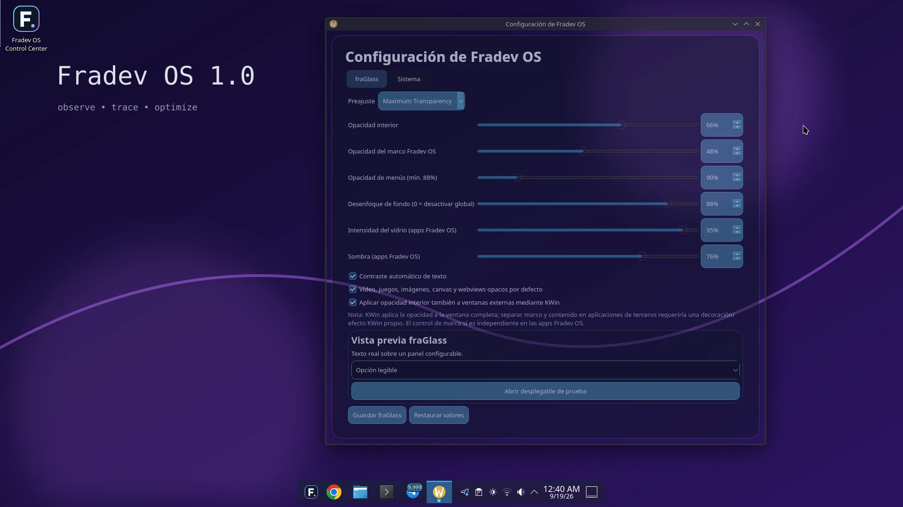
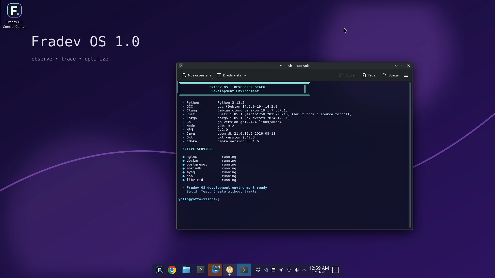
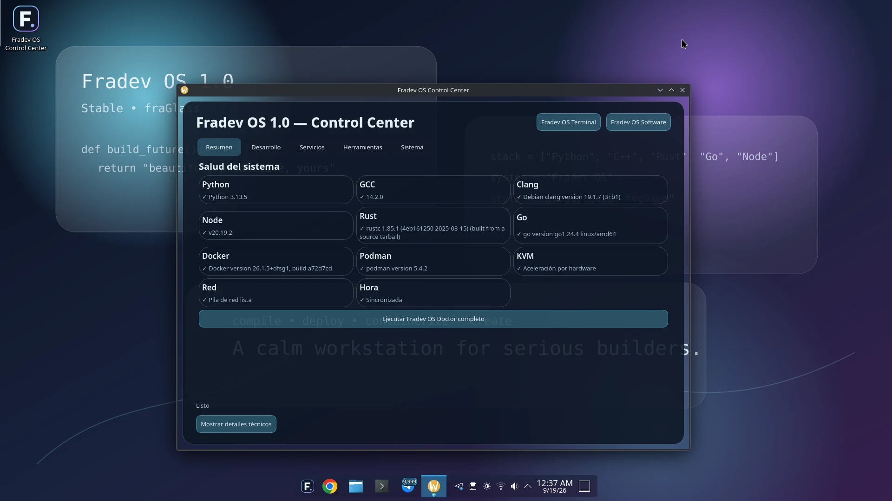
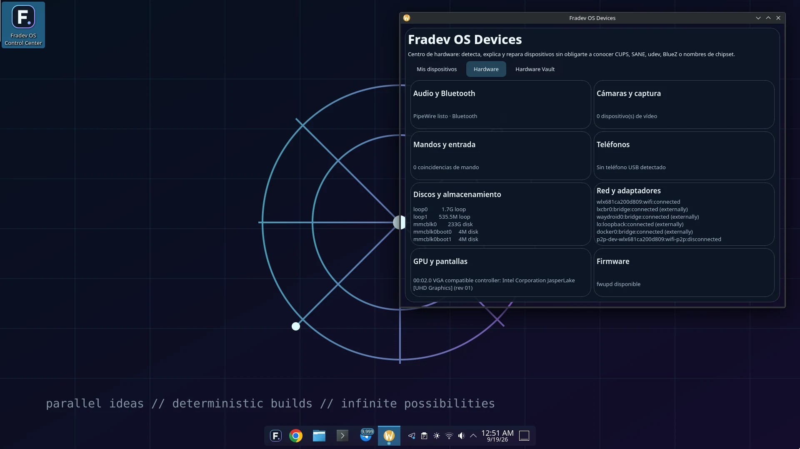
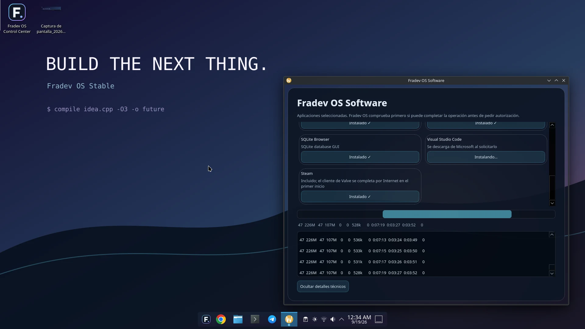

  

<h1 align="center">Fradev OS 1.0 Stable 2</h1>

<em>Un sistema para crear sin límites.</em>

  
  
  
  

---

## Sobre Fradev OS

**Fradev OS** es un sistema operativo Linux de escritorio basado en **Debian 13**, creado por **Fraudy Martínez Madruga** y pensado para desarrollo, productividad, compatibilidad, juegos y asistencia local con **Fradev AI**.

---

## ✨ Características

<table>
<tr>
<td width="50%" valign="top">

### 🛠️ Entorno de desarrollo
Listo para trabajar desde el primer arranque: Python, C/C++, Rust, Go, Java, Web, contenedores, bases de datos y virtualización.

</td>
<td width="50%" valign="top">

### 🪟 fraGlass
La identidad visual de Fradev OS: una experiencia moderna, translúcida y totalmente configurable.

</td>
</tr>
<tr>
<td width="50%" valign="top">

### 🖥️ Compatibilidad ampliada
Ejecuta una amplia variedad de aplicaciones y flujos de trabajo sin fricción.

</td>
<td width="50%" valign="top">

### 🎮 Steam + Game Lab
Juegos y experimentación, integrados en el sistema.

</td>
</tr>
<tr>
<td width="50%" valign="top">

### 🖨️ Devices
Gestión sencilla de impresoras, escáneres y dispositivos del día a día.

</td>
<td width="50%" valign="top">

### 🎛️ Control Center
El punto central desde el que se gobierna todo el sistema.

</td>
</tr>
</table>

> ### 🤖 Fradev AI
> Asistente local opcional para programación, depuración y consultas técnicas. Los modelos se descargan aparte, según el hardware de cada usuario.

---

## 🔄 Canal estable

**Fradev OS 1.0 Stable 2** es la base pública actual. El sistema puede recibir revisiones firmadas a través de su canal estable de actualizaciones.

La revisión pública más reciente declarada por el canal estable es **R19**.

---

## 📸 Capturas reales

Capturas tomadas directamente de **Fradev OS 1.0 Stable 2 funcionando en hardware real**.

<table>
<tr>
<td width="50%" valign="top" align="center">
<strong>Developer Stack</strong> 

</td>
<td width="50%" valign="top" align="center">
<strong>fraGlass</strong> 

</td>
</tr>
<tr>
<td width="50%" valign="top" align="center">
<strong>Control Center</strong> 

</td>
<td width="50%" valign="top" align="center">
<strong>Devices</strong> 

</td>
</tr>
<tr>
<td colspan="2" valign="top" align="center">
<strong>Fradev OS Software</strong> 

</td>
</tr>
</table>

---

## ⬇️ Descarga

  

---

## ℹ️ Proyecto oficial

Este repositorio contiene la presencia pública oficial de Fradev OS: sitio web, recursos públicos y canal de actualizaciones. No es documentación interna del proceso de desarrollo.

## Autoría, atribución y derechos

**Fradev OS fue creado por Fraudy Martínez Madruga.**

Copyright © 2026 Fraudy Martínez Madruga. Todos los derechos reservados sobre los materiales originales de Fradev OS, salvo donde se indique expresamente lo contrario.

El nombre, identidad visual, documentación propia, sitio web, interfaces, arte original y demás materiales originales de Fradev OS no pueden presentarse como creación de terceros ni reatribuirse sin autorización.

Los componentes de terceros incluidos o utilizados por Fradev OS conservan sus respectivos autores, licencias y derechos.

Consulta [COPYRIGHT.md](COPYRIGHT.md) y [NOTICE](NOTICE) para más información.

---

## 🔗 Enlaces

- 🌐 **Web oficial:** https://yottomtnz.github.io/fradevosupdate/
- 💻 **Repositorio oficial:** https://github.com/YottoMtnz/fradevosupdate
- 📦 **Releases:** https://github.com/YottoMtnz/fradevosupdate/releases
